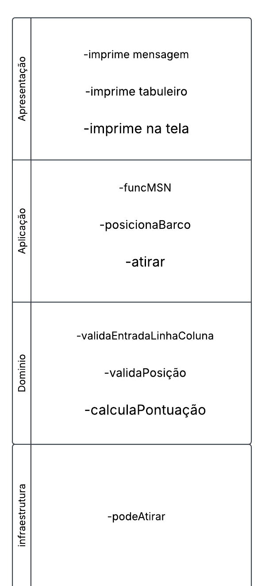
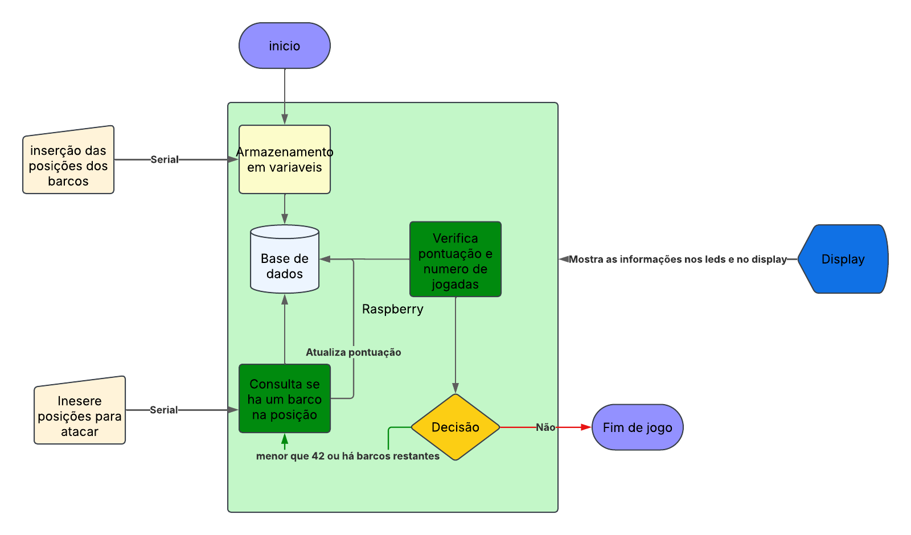

# Projeto: Batalha Naval em Matriz de LEDs com Pontuação OLED

## 1. Escopo do Projeto

**Nome:** Helder Lourenço de Abreu Marques  
**Link do projeto:** [GitHub - Batalha do Mal](https://github.com/F1reFinger/Batalha_do_Mal)

### Apresentação do Projeto
O projeto consiste em um jogo de batalha naval baseado em uma matriz de LEDs SMD 5050 de 5x5 para exibição do campo de batalha e um monitor OLED SSD1306 para exibição da pontuação. O controle será realizado por um joystick analógico para movimentação e um botão para seleção.

### Título do Projeto
**Batalha Naval em Matriz de LEDs com Pontuação OLED**

### Objetivos do Projeto
- Desenvolver um jogo de batalha naval interativo utilizando a placa BitDogLab.
- Criar uma interface intuitiva com LEDs e um display OLED.
- Implementar controles responsivos com joystick e botões.

### Principais Requisitos
- Matriz de LEDs 5x5 para exibição do jogo.
- Monitor OLED SSD1306 para exibição da pontuação.
- Controle via joystick analógico e botão para seleção.
- Implementação utilizando a BitDogLab e suas conexões I2C.

### Descrição do Funcionamento
Na fase de preparação, o jogador recebe um prompt para definir onde os barcos estarão posicionados. Com isso, os barcos de tamanho 1x1 são colocados. O jogador movimenta um cursor pela matriz de LEDs utilizando o joystick analógico. Ao pressionar o botão de seleção, um tiro é disparado. Se o tiro atingir um alvo, o LED correspondente pisca e a pontuação é atualizada no display OLED.

### Justificativa
Este projeto explora conceitos fundamentais de sistemas embarcados, como controle de hardware via software, comunicação I2C e interatividade com o usuário. Além disso, promove uma abordagem didática para o aprendizado de eletrônica e programação.

### Originalidade
Embora existam jogos de batalha naval eletrônicos, esta implementação específica utilizando BitDogLab, matriz de LEDs SMD 5050 e display OLED apresenta um design inovador e simplificado para sistemas embarcados.

Outro ponto importante é que este projeto foi desenvolvido para a disciplina de APC (Algoritmos de Programação de Computadores), uma matéria introdutória que auxilia no aprendizado de programação, bem como no projeto Embarcatech. O código de batalha naval usa somente a biblioteca `<stdio.h>`, o que facilita muito para programadores iniciantes.

## 2. Hardware

### Diagrama em Blocos

imagem de autoria do autor

### Função de Cada Bloco
- **Matriz de LEDs (5x5):** Representa o campo de batalha.
- **OLED SSD1306:** Exibe a pontuação do jogador.
- **Joystick Analógico:** Move o cursor na matriz.
- **Botão B:** Confirma a seleção/disparo.
- **BitDogLab:** Processamento e controle do jogo.

### Configuração de Cada Bloco
- **Matriz de LEDs:** Controlada pelo microcontrolador, utilizando o pino de dados para manipulação das cores.
- **OLED:** Comunicação via I2C (pinos SDA e SCL).
- **Joystick:** Lê valores analógicos para determinar a direção do cursor.
- **Botão A:** Configurado como entrada digital para registrar cliques.

### Especificações
O projeto atende aos requisitos de baixo custo, tamanho compacto e baixo consumo de energia, sendo ideal para aplicações embarcadas, com o objetivo de ensinar a programação de embarcados.

### Lista de Materiais
| Componente                   | Quantidade |
|------------------------------|------------|
| Matriz de LEDs SMD 5050 5x5   | 1          |
| OLED SSD1306                  | 1          |
| Joystick analógico           | 1          |
| Botão A                       | 1          |
| BitDogLab                     | 1          |

### Descrição da Pinagem Usada
| Pino  | Função                    |
|-------|---------------------------|
| 7     | Controle da matriz de LEDs |
| 14    | I2C SDA (OLED)            |
| 15    | I2C SCL (OLED)            |
| 6     | Botão B                   |

### Circuito Completo do Hardware

imagem 3 circuito de hardware oficial disponivel em: https://embarcados.com.br/bitdoglab-uma-jornada-educativa-com-eletronica-embarcados-e-ia/

## 3. Software

### Blocos Funcionais

imagem de autoria do autor

### Descrição das Funcionalidades
- Inicialização do hardware.
- Controle da matriz de LEDs.
- Leitura do joystick e botões.
- Atualização do display OLED com a pontuação.
- Implementação da lógica do jogo (movimentação, disparo e pontuação).

### Definição das Variáveis
- **matrix[5][5]:** Armazena o estado da matriz de LEDs.
- **cursor_x, cursor_y:** Posição do cursor.
- **score:** Pontuação do jogador.

### Fluxograma

imagem de autoria do autor

### Inicialização
- Configuração dos pinos.
- Inicialização do display OLED via I2C.
- Configuração do joystick e botões.

### Configuração dos Registros
- Verificar configurações de compilação através do CMake.

### Estrutura e Formato dos Dados
Os dados são armazenados em matrizes e variáveis simples, facilitando o acesso e manipulação.

### Organização da Memória
Memória dividida entre variáveis de controle, estado da matriz e dados do display OLED.

### Protocolo de Comunicação
O display OLED se comunica via protocolo I2C. Cada comando enviado ao OLED segue o protocolo I2C, incluindo o endereço do dispositivo e dados da tela.

## 4. Execução do Projeto

### Metodologia
1. Pesquisa sobre jogos embarcados.
2. Seleção dos componentes compatíveis com a BitDogLab.
3. Implementação do código e configuração de hardware.
4. Testes e ajustes na lógica do jogo.

### Testes de Validação
- Verificação da resposta do joystick.
- Teste do acionamento dos LEDs.
- Atualização correta do display OLED.
- Funcionamento da lógica de pontuação.

### Algoritmo feito em C rodando no GCC
O algoritmo está rodando diretamente na BitDogLab.

### Discussão dos Resultados
O projeto demonstrou ser funcional e responsivo, oferecendo uma experiência interativa. A integração entre os componentes foi validada com sucesso.

### Vídeo de Demonstração
[Vídeo 1 - Demonstração](https://youtube.com/shorts/z77axaXgo5c?feature=share)  
[Vídeo 2 - Melhor Execução](https://youtube.com/shorts/eb-9ZTmEx_k?feature=share)

OBS: os videos estão disponiveis no repositorio na pasta imagens

## Conclusão

O objetivo deste projeto é ser um projeto facilmente replicável tanto a nível de desenvolvimento de programação para sistemas operacionais mais robustos quanto para sistemas embarcados.

### Melhorias
Apesar de inúmeros esforços, muitas partes da documentação e da execução ainda precisam de correções, como por exemplo, o Ninja precisa de dados deixados pelo CMake ao compilar o código para a placa. Além disso, diversos problemas ocorreram em sistemas operacionais Unix-like (como o Manjaro Linux), causando atrasos e bugs inexplicáveis, o que afetou o desenvolvimento do projeto. Mudanças foram feitas em bibliotecas, algumas foram mais difíceis de compilar, e outras poderiam agilizar o uso da placa.

O código de Batalha Naval pode ser encontrado na íntegra no repositório do projeto:  
[Repositório GitHub - Batalha Naval](https://github.com/F1reFinger/batalha-naval)

### Fontes
- Repositório dos quais foram aproveitados exemplos:  
  [GitHub - BitDogLab](https://github.com/BitDogLab/BitDogLab-C)

- Repositório oficial da bitdoglab:  
  [pagina oficial - BitDogLab](https://embarcados.com.br/bitdoglab-uma-jornada-educativa-com-eletronica-embarcados-e-ia/)
  
- Algumas funções de ponteiros:  
  [Tutorial de Funções de Ponteiros](https://www.tutorialspoint.com/c_standard_library/stdio_h.htm)
